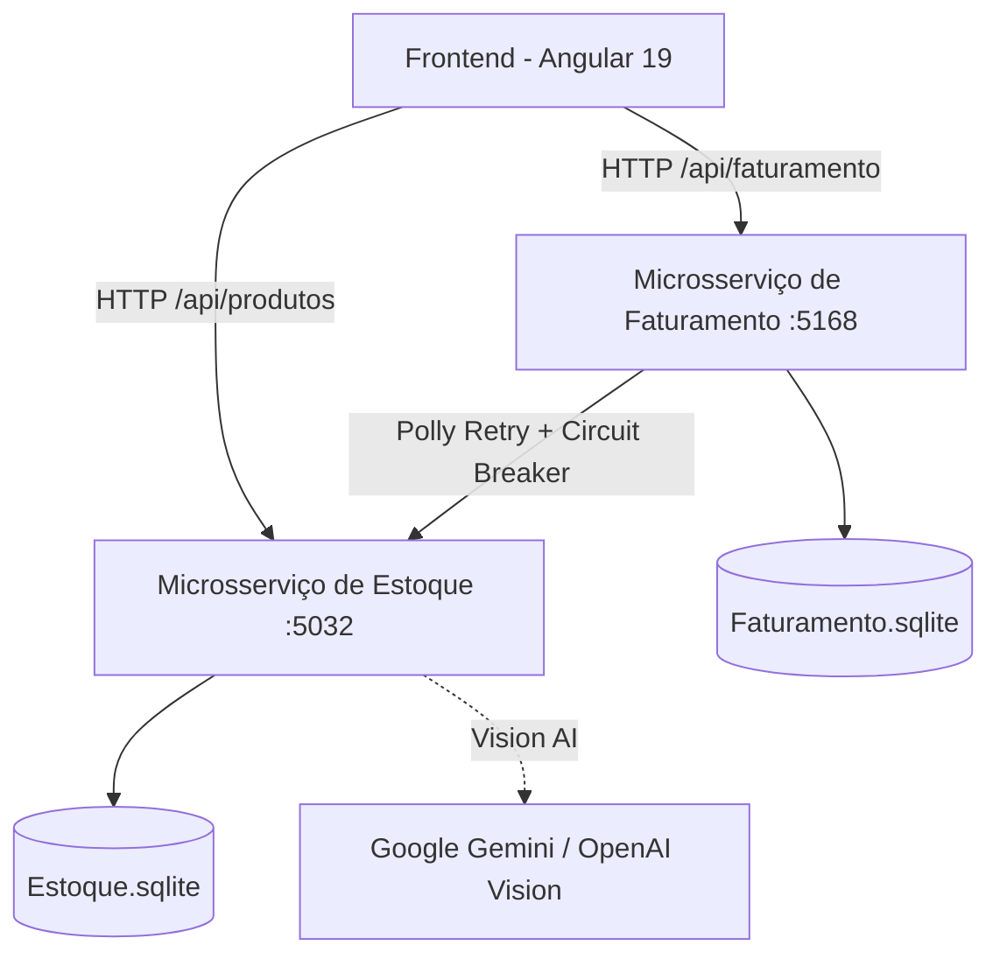

# 🚀 Sistema ERP: Emissão de Notas Fiscais & Gestão de Estoque

Aplicação empresarial completa implementando uma arquitetura moderna e resiliente de microsserviços em **.NET 8 (C#)**, frontend reativo em **Angular 19**, persistência física em banco de dados **SQLite**, suporte a **Inteligência Artificial (Google Gemini / OpenAI)**, **Controle de Concorrência Otimista**, **Polly (Retry & Circuit Breaker)** e **Transação Compensatória (Saga Rollback)**.

---

## 📑 Sumário

- [Visão Geral da Arquitetura](#-visão-geral-da-arquitetura)
- [Funcionalidades e Escopo](#-funcionalidades-e-escopo)
- [Requisitos de Resiliência e Concorrência](#-requisitos-de-resiliência-e-concorrência)
- [Configuração da Inteligência Artificial (Google Gemini / OpenAI)](#-configuração-da-inteligência-artificial)
- [Detalhamento Técnico da Implementação](#-detalhamento-técnico-da-implementação)
- [Como Executar o Projeto](#-como-executar-o-projeto)
- [Scripts de Testes Automatizados](#-scripts-de-testes-automatizados)
- [Estrutura do Repositório](#-estrutura-do-repositório)

---

## 🏛 Visão Geral da Arquitetura

O sistema é composto por **dois microsserviços independentes** no backend e uma aplicação frontend em Angular:



### Serviços e Portas

| Serviço | Tecnologia | Porta | Documentação Swagger | Health Check |
| :--- | :--- | :--- | :--- | :--- |
| **Frontend** | Angular 19 (Standalone + RxJS) | `http://localhost:4200` | - | - |
| **Microsserviço de Estoque** | .NET 8 / C# Minimal APIs | `http://localhost:5032` | `/swagger` | `/health` |
| **Microsserviço de Faturamento** | .NET 8 / C# Minimal APIs | `http://localhost:5168` | `/swagger` | `/health` |

---

## 🎯 Funcionalidades e Escopo

### 1. Cadastro e Gestão de Produtos
- Campos: **Código**, **Descrição** (nome do produto) e **Saldo** (quantidade disponível em estoque).
- Suporte a upload de foto/imagem do produto com **reconhecimento automático via IA (Vision)**.
- Validações de integridade (código único, saldo não negativo, campos obrigatórios).
- Ajustes manuais de estoque (entrada e saída com validação de saldo).

### 2. Cadastro e Emissão de Notas Fiscais
- **Numeração sequencial automática** e status inicial **Aberta**.
- Inclusão dinâmica de **múltiplos produtos** com suas respectivas quantidades.
- Interface intuitiva com busca/seleção de produtos e totalizadores em tempo real.

### 3. Impressão de Notas Fiscais
- Botão de impressão com **indicador visual de processamento** (loading / spinner).
- Atualização do status da nota fiscal para **Fechada** após a finalização com sucesso.
- Bloqueio de impressão para notas com status diferente de **Aberta** (botão desabilitado no frontend e validação defensiva no backend).
- **Atualização atômica do saldo dos produtos** proporcional à quantidade utilizada na nota.

---

## 🛡 Requisitos de Resiliência e Concorrência

### 1. Arquitetura de Microsserviços Desacoplada
- **Serviço de Estoque**: Responsável exclusivamente pelo catálogo de produtos, saldos, ajustes, baixas e estornos.
- **Serviço de Faturamento**: Responsável pela emissão, itens, ciclo de vida e impressão de notas fiscais, comunicando-se com o Estoque via HTTP com tolerância a falhas.

### 2. Tratamento de Falhas e Resiliência
- **Polly HttpClient Integration**:
  - **Retry Exponencial**: 3 tentativas (1s, 2s, 4s) com log detalhado em console para falhas transitórias.
  - **Circuit Breaker**: Interrompe chamadas por 15 segundos após 2 falhas consecutivas, prevenindo sobrecarga em cascata.
  - **Timeout Policy**: Timeout de 5s por tentativa.
- **Transação Compensatória (Saga Rollback)**:
  - Ao imprimir uma NF com múltiplos itens, se a baixa de um dos itens falhar (por saldo insuficiente ou erro de rede), o sistema **estorna automaticamente todos os itens que já haviam sido debitados**, mantendo o status da nota **Aberta** e o estoque 100% íntegro.
- **Health Checks & Monitoramento**:
  - Endpoints `/health` em ambos os serviços e endpoint `/api/faturamento/status-dependencias`.
  - Header reativo no Frontend com badges de status em tempo real.

### 3. Conexão Real com Banco de Dados
- Persistência física em arquivos SQLite (`Estoque.sqlite` e `Faturamento.sqlite`) utilizando **Entity Framework Core** com versionamento via **Migrations**.

### 4. Tratamento de Concorrência (Optimistic Concurrency)
- Implementado controle de concorrência com **`[Timestamp] byte[] RowVersion`** nas entidades de Produto e controle transacional no EF Core.
- Cenário garantido: **dois operadores tentando consumir simultaneamente o mesmo saldo residual**. O sistema atende um com sucesso e bloqueia o outro de forma segura, evitando estoque negativo.

---

## 🤖 Configuração da Inteligência Artificial

O projeto conta com o serviço `IaVisionService` que identifica automaticamente produtos a partir de fotos/imagens enviadas no cadastro.

Por motivos de segurança e boas práticas para publicação no GitHub, o arquivo de configuração versionado `Estoque/appsettings.json` **não contém chaves privadas**.

### Como configurar sua API Key localmente (escolha uma das opções):

#### Opção A: Variável de Ambiente (Recomendado)
Configure a variável de ambiente `GEMINI_API_KEY` no seu sistema:

- **Windows (PowerShell):**
  ```powershell
  $env:GEMINI_API_KEY="sua-chave-api-aqui"
  ```
- **Windows (CMD):**
  ```cmd
  set GEMINI_API_KEY=sua-chave-api-aqui
  ```
- **Linux / macOS / Git Bash:**
  ```bash
  export GEMINI_API_KEY="sua-chave-api-aqui"
  ```

#### Opção B: .NET User Secrets (Para Desenvolvimento Local)
```bash
cd Estoque
dotnet user-secrets init
dotnet user-secrets set "IA:ApiKey" "sua-chave-api-aqui"
```

#### Opção C: `appsettings.Development.json`
Você pode preencher a chave no arquivo `Estoque/appsettings.Development.json` (que já está no `.gitignore` e não será enviado ao repositório).

> 💡 **Mecanismo de Fallback Inteligente**: Caso nenhuma chave seja configurada, o sistema não falha; ele ativa automaticamente um algoritmo heurístico inteligente que deduz o nome do produto a partir dos metadados da imagem, permitindo o fluxo completo da aplicação mesmo sem conexão à API de IA.

---

## 📋 Detalhamento Técnico da Implementação

### 1. Ciclos de Vida do Angular Utilizados
- **`ngOnInit`**: Inicialização de formulários, carga inicial de dados via APIs e disparo de health checks.
- **`ngOnDestroy`**: Cancelamento de subscriptions de observables (`takeUntil(this.destroy$)`), timers e polling, prevenindo *memory leaks*.
- **`ngOnChanges`** / Inputs Reativos: Modais de produto, saldo e nota reagindo dinamicamente às mudanças do componente pai.

### 2. Uso da Biblioteca RxJS
- **`HttpClient` Observables**: Chamadas REST assíncronas tratadas com `.pipe()`.
- **`Subject` / `BehaviorSubject`**: Gerenciamento do `ToastService`, controle de estados reativos e cancelamento de subscriptions.
- **`interval` & `switchMap`**: Monitoramento contínuo de integridade no `HealthService` a cada 10 segundos.
- **`catchError`**: Tratamento centralizado e conversão de falhas HTTP em notificações amigáveis.
- **`tap` / `finalize`**: Controle declarativo de estados de carregamento (*spinners*).

### 3. Bibliotecas e Dependências Utilizadas
- **Backend (.NET 8)**:
  - `Microsoft.EntityFrameworkCore.Sqlite`: Banco de dados relacional em arquivo físico.
  - `Microsoft.EntityFrameworkCore.Design`: Suporte a Migrations.
  - `Microsoft.Extensions.Http.Polly` & `Polly`: Resiliência (Retry, Circuit Breaker e Timeout).
  - `Swashbuckle.AspNetCore` / `Microsoft.AspNetCore.OpenApi`: Documentação interativa Swagger UI.
  - `Microsoft.AspNetCore.Diagnostics.HealthChecks`: Monitoramento de integridade dos serviços.
- **Frontend (Angular 19)**:
  - `@angular/common/http`: Comunicação HTTP REST com microsserviços.
  - `@angular/forms`: Formulários reativos com validações em tempo real.
  - `@angular/router`: Roteamento Single Page Application (SPA).

### 4. Componentes Visuais e Estilização
- **Vanilla CSS 3 Moderno**:
  - Paleta de cores corporativa com variáveis de Design System;
  - Cards elevados, tabelas responsivas, badges de status, modais com backdrop blur;
  - Micro-animações e spinners para feedback de interação;
  - Ícones SVG vetoriais integrados de alta performance.

### 5. Arquitetura Backend e Frameworks C#
- **.NET 8** com **ASP.NET Core Minimal APIs**, estrutura em Clean Architecture segregada em camadas (*API*, *Application*, *Domain*, *Infrastructure*, *Data*).
- **Entity Framework Core 8**.

### 6. Tratamento de Exceções e Erros no Backend
- **Domain Exceptions Especializadas**: `ProdutoNaoEncontradoException`, `SaldoInsuficienteException`, `NotaFiscalNaoEncontradaException`, `NotaFiscalNaoPodeSerImpressaException`, `FalhaAoImprimirNotaFiscalException`.
- **Mapeamento Semântico HTTP**: `400 Bad Request`, `404 Not Found`, `409 Conflict`, `422 Unprocessable Entity`, `503 Service Unavailable`.
- **Payload Padronizado de Resposta**: Respostas ricas com `mensagem`, `detalhes`, `servicoAfetado`, `recuperavel` e `estornoExecutado`.

### 7. Uso do LINQ
- Utilização extensiva em consultas assíncronas ao EF Core e transformações em memória:
  - `.FirstOrDefaultAsync(p => p.Codigo == codigo)`
  - `.ToListAsync()` / `.OrderByDescending(n => n.DataCriacao)`
  - `.Include(n => n.Itens)` (*Eager Loading*)
  - `.MaxAsync(n => (int?)n.Numero)`
  - `.Where(p => p.Saldo > 0)`
  - `.Any()` / `.Sum(i => i.Quantidade)`
  - `.Select(item => ...)`

---

## 🚀 Como Executar o Projeto

### Pré-requisitos
- [.NET SDK 8.0+](https://dotnet.microsoft.com/download)
- [Node.js 18+](https://nodejs.org/)
- [Angular CLI](https://angular.io/cli) (opcional, pode-se usar `npm start`)

### 1. Iniciar o Microsserviço de Estoque
```bash
cd Estoque
dotnet run
```
> O serviço estará disponível em `http://localhost:5032` (Swagger: `http://localhost:5032/swagger`)

### 2. Iniciar o Microsserviço de Faturamento
```bash
cd Faturamento
dotnet run
```
> O serviço estará disponível em `http://localhost:5168` (Swagger: `http://localhost:5168/swagger`)

### 3. Iniciar o Frontend Angular
```bash
cd Frontend
npm install
npm start
```
> Acesse a aplicação no seu navegador: `http://localhost:4200`

---

## 🧪 Scripts de Testes Automatizados

Na raiz do projeto estão disponíveis scripts prontos para demonstrar os requisitos de concorrência e resiliência:

### Teste de Concorrência (2 notas disputando 1 unidade de saldo)
- No PowerShell:
  ```powershell
  .\testar_concorrencia.ps1
  ```
- No Bash (Linux / Git Bash):
  ```bash
  bash testar_concorrencia.sh
  ```

### Teste de Resiliência & Saga Rollback
- No PowerShell:
  ```powershell
  .\testar_resiliencia.ps1
  ```
- No Bash (Linux / Git Bash):
  ```bash
  bash testar_resiliencia.sh
  ```

### Limpar e Recriar os Bancos SQLite do Zero
```bash
bash limpar_banco.sh
```

---

## 📁 Estrutura do Repositório

```
Projeto-ERP/
├── Estoque/                    # Microsserviço de Produtos e Saldo (.NET 8)
│   ├── API/Endpoints/          # Minimal APIs & Upload/IA Endpoints
│   ├── Application/UseCases/   # Casos de uso de negócio
│   ├── Domain/                 # Entidades e Exceções de Domínio
│   ├── Infrastructure/         # Repositórios e Serviços (IaVisionService)
│   └── Migrations/             # Migrations do SQLite
├── Faturamento/                # Microsserviço de Notas Fiscais (.NET 8)
│   ├── Api/EndPoints/          # Endpoints REST e Status de Dependências
│   ├── Application/UseCases/   # Casos de uso (Criar, Imprimir com Saga Rollback)
│   ├── Domain/                 # Entidades, Itens e Exceções
│   └── Infrastructure/         # Polly HttpClient e Repositórios
├── Frontend/                   # Aplicação Angular 19
│   ├── src/app/components/     # Dashboard, Produtos, Faturamento, Modais, Header
│   ├── src/app/services/       # Serviços HTTP e Health Checks
│   └── src/app/models/         # Interfaces TypeScript
├── testar_concorrencia.ps1     # Script de validação de concorrência
├── testar_resiliencia.ps1      # Script de validação de falhas e saga rollback
├── limpar_banco.sh             # Script para reset rápido dos bancos
└── README.md                   # Documentação completa do projeto
```

---

Desenvolvido com dedicação por **Vanessa**.

